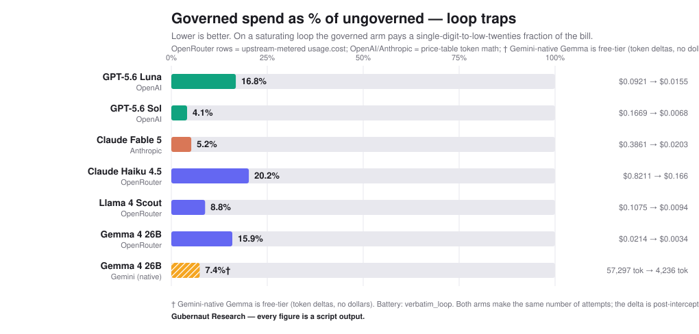

# Receipts

*Gubernaut Research. The measured benchmark outputs, the render-ready chart, and the launch
copy. Every number here is a script output you can re-run from the source.*

> The controller that produced these numbers lives alongside them, in
> [`../packages/`](../packages/). Every figure below is reproducible from it, and
> [`../docs/REPRODUCE.md`](../docs/REPRODUCE.md) is the procedure.

---

## The one-line adoption

```python
client = OpenAI(base_url="http://localhost:8000/v1")   # the Gubernaut local proxy
```

Start it first with `gcc-proxy --upstream https://api.openai.com`, which binds that port.

A deterministic homeostatic controller reads three bounded numbers per turn, intensity,
valence and repetition, and nothing else. No prompt can steer it, because no token sequence
crosses into the meta level. When repetition saturates it commands a re-grounding posture,
and if the loop persists it hard-stops the call locally: a deterministic fallback
completion, **zero upstream tokens.** Benign traffic passes through untouched.

## The finding

On a saturating loop the governed arm pays **4.1% to 20.2%** of the ungoverned bill across
the seven model families tested, with the hard stop landing at turn 4 every run.

Both arms make the same number of attempts. The spend delta is the entire measurement.



| | Ungoverned | Governed | Governed as % |
| --- | --- | --- | --- |
| GPT-5.6 Sol, 25-attempt verbatim loop | $0.1669 | $0.0068 | 4.1% |
| Claude Fable 5, same battery | $0.3861 | $0.0203 | 5.2% |

| Where the numbers come from | File |
| --- | --- |
| Chart data (7 series, verbatim-loop battery) | [`telemetry/receipts_matrix_chart.json`](telemetry/receipts_matrix_chart.json) |
| Per-cell receipts (native `usage.cost` where available) | [`telemetry/openrouter_gemini_receipts.json`](telemetry/openrouter_gemini_receipts.json) |
| Cross-vendor savings matrix (markdown) | [`telemetry/savings_matrix.md`](telemetry/savings_matrix.md) |
| Homeostatic recovery telemetry | [`telemetry/framework_stress_test.csv`](telemetry/framework_stress_test.csv) |
| Proxy added-latency sample | [`telemetry/latency_sample.json`](telemetry/latency_sample.json) |
| Live LangChain and Eliza-pattern intercept | [`telemetry/framework_clients.json`](telemetry/framework_clients.json) |
| Coercive-veto results | [`telemetry/lane_e_veto_results.md`](telemetry/lane_e_veto_results.md) |

## Two cross-check notes, which travel with the data

OpenRouter's own metered cost matched the token-price math for Haiku exactly and for Gemma
within 13%, and flagged a **24% divergence for Llama 4 Scout** on provider routing. Scout's
dollars are therefore the upstream's meter rather than the token math. The *ratio* is
unaffected.

Gemma on Google's native API is free-tier only, so that row is token deltas and not dollars.

## Validation behind the regulation layer

Regulated beats baseline in **15 of 16** generator by judge cells (**11/12 off-diagonal**),
**13/16 at p<.05**, across four frontier model families. The single null cell is GPT by
Gemini at **-0.04**, reported rather than patched. The deciding core is ported to Rust and
verified bit-exact against the Python reference.

DOI: **10.5281/zenodo.21303518** · arXiv: **2607.24339**

It is a regulation layer, measured and falsifiable, with no cognition claims.

## What is in this folder

| | |
|---|---|
| [`telemetry/`](telemetry/) | the spend measurements above, per cell |
| [`onchain/`](onchain/) | **the on-chain run.** A runaway retry loop severed at turn 4 on a local ephemeral EVM devnet, with real transaction hashes. 3 governed transactions against 8 ungoverned, and 210 concurrent agents all severed with 0 drops |
| [`engineering/`](engineering/) | **the SDK evidence.** Edge soaks (5,037 and 10,000 ticks, bit-exact, flat memory), the three scoped latency figures, 240-way concurrency isolation, the fail-safe hardening round that found 4 leaks in our own code, and the "just a prompt" ablation |
| [`receipts_matrix_chart.svg`](receipts_matrix_chart.svg) | the rendered chart |
| [`SHOW_HN.md`](SHOW_HN.md) | the launch write-up |

Reproduce any of it: [`../docs/REPRODUCE.md`](../docs/REPRODUCE.md).

---

*Byline: Gubernaut Research. No geographic identifiers; canon vocabulary only.*
